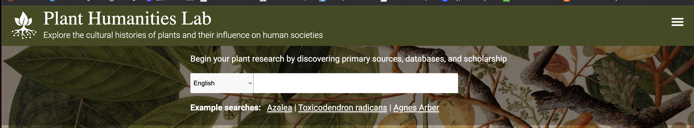
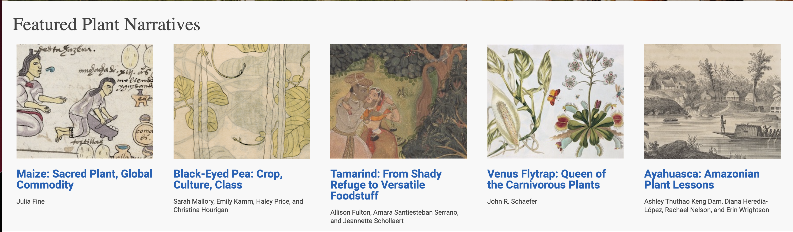

## Source

[Plant Humanities Lab. Accessed December 1, 2022.](https://lab.plant-humanities.org)

## Evaluation

One of the most interesting projects among the listed DH Projects on Canvas is the Plant Humanities Lab. I will dedicate this page to an evaluation of the project from both the lens of humanities and computer science. 

Quoting JSTOR Labs, the organization that enabled the creation of Plant Humanities Lab, "The Plant Humanities Lab uses original scholarship, linked open data and integrated primary and secondary resources to narrate and to foster the exploration of the cultural histories of plants and their influence on human societies."  The beta version of Plant Humanities Lab was recently released in March 2021, which is less than two years ago from today. I will delve into the more technical aspects of the project such as data structure and linked libraries first. Once you open the window of the page, there is a search bar on the middle top of the page, which is the screenshot attached below. The search engine links to a vast amount of primary and secondary sources and repositories including WikiData, JSTOR Global Plants, and even the Biodiversity Heritage Library. The tool underlying the written descriptions of the Plant Humanities Lab is callled Juncture, which effectively helps researchers construct complex and compelling narratives using state-of-the-art tools for digital writing. 

Now once I click into the page, there are a variety of interactions that I can perform with different elements on the page. For example. as shown below, information is sectioned into different categories such as "Featured Plant Narratives", where you can learn about the history of the plant and how it impacted the evolution of humanities. 

