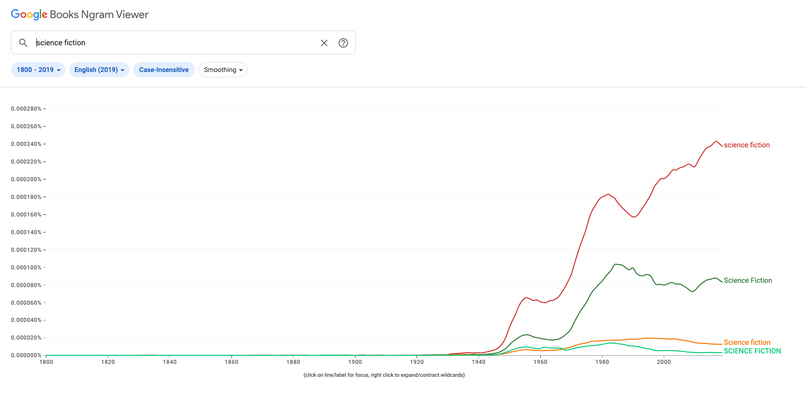
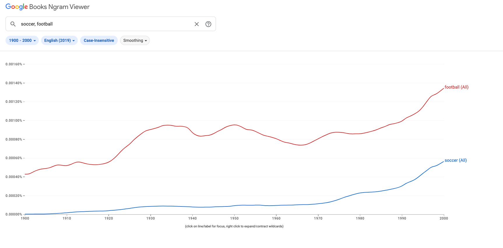

## Source

[Google. (n.d.). Google books Ngram Viewer. Google Books. Retrieved October 3, 2022.](https://books.google.com/ngrams)

## Evaluation

The "Google Books Ngram Viewer" is a digital tool that allows users to graphically view the rate of occurrence of ngrams in a corpus of books over the selected date range. This is particularly interesting, for this tool shows us how frequent the occurrence of a given ngram is over the years, which can be used to analyze the trends in use of such phrases in the corpus which can further be used to derive contextual information about those phrases in that time period. According to [HistoryOfInformation](https://www.historyofinformation.com/detail.php?id=3786), this tool was developed by Jon Orwant and Will Brockman at Google and was released in mid-December 2010.

As the name of the project suggests, the most basic question that this tool answer is "Given a query ngram X, out of all ngrams contained in Google Books, what percentage of them are X?" Even though this is the basic feature of the tool, it is definitely not everything it can do. Advanced search filters can be used and one can even search for ngrams where the search phrase is misspelled or gibberish! Case-insensitive search further allows more complicated searches to be performed, from which the context of the ngrams can be better analyzed from the resulting graph. As an example, a search for the bigram "science fiction" shows the following result:

We can observe from this graph alone that the bigram "science fiction" did not become popular in the English corpus until the late 1940s. At the peak at around 2017, the y-axis value of 0.000244% indicates that "science fiction" bigram accounts for about 0.000244% of all bigrams in the English corpus published since 1800.

The primary technology used by Google to analyze texts and produce this graphs is Natural Language Processing and Optical Character Recognition (OCR). Google Books serves as a massive source of data for this tool and is rightly used to create these charts. Moreover, the fact that one can search for different parts of speech for ngrams is also a great feature that will help researchers and historians. For instance, one can use this tool to search for cook (as a noun) vs cook (as a verb). 

A drawback of this tool that I think is pretty significant is that it only shows ngrams and their occurrence frequency in texts published over a certain date range; it fails to depict the context in which the ngram is used. Likewise, another improvement that I can think of that would be helpful to make this tool even powerful is to add support for other languages like Greek and Sanskrit. There are thousands of important historical texts written in these languages, and being able to see the trends of ngrams in these languages would be a game changer for historians and enthusiasts alike. Another aspect that might contribute to inaccurate results is the effectiveness (or the lack thereof) of OCR technology to read and understand old text accurately.

To conclude, here is an interesting result where I compare the unigrams "soccer" and "football" and how they appear in the English corpus published between 1900-2000:

