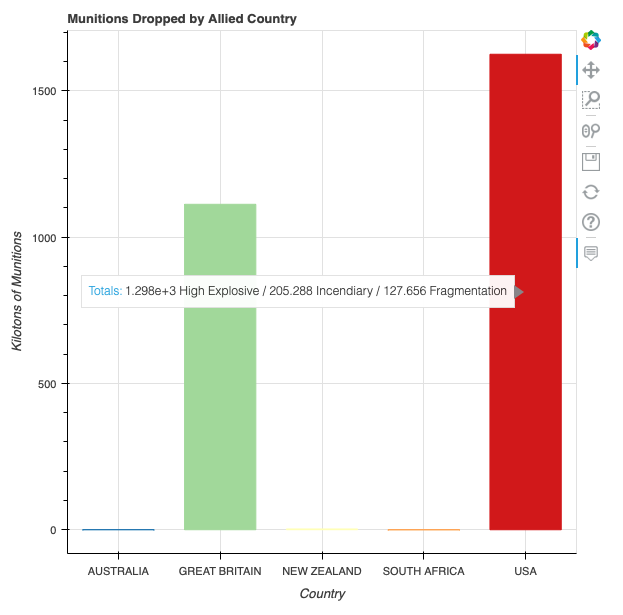
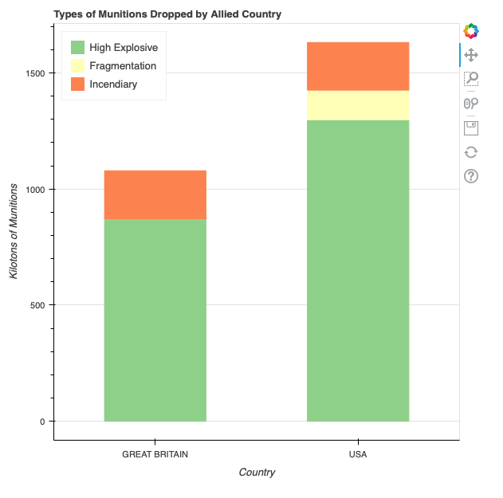
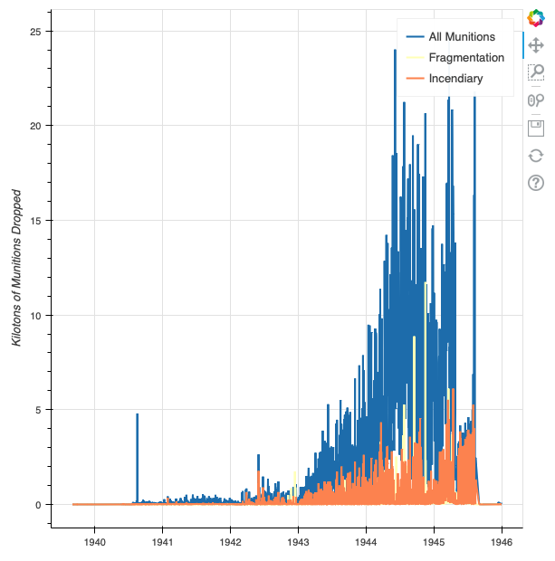
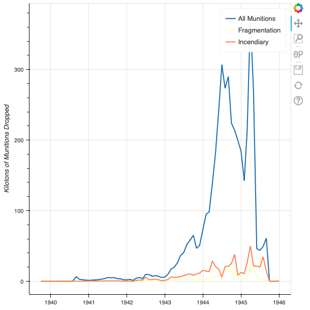
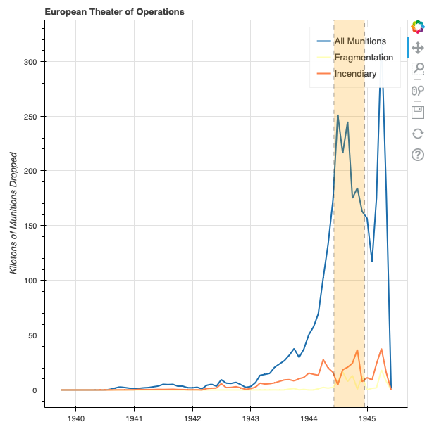
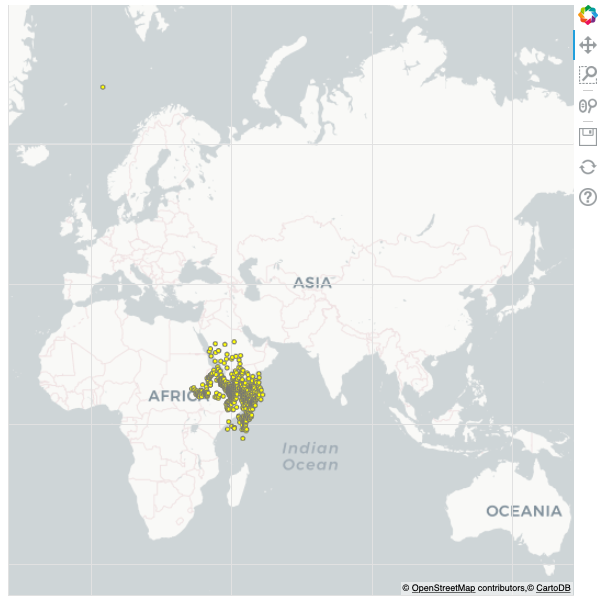

## Source
[Harper, C. (2018). Visualizing data with Bokeh and Pandas. _The Programming Historian_, 7. https://doi.org/10.46430/phen0081](https://programminghistorian.org/en/lessons/visualizing-with-bokeh)

## Reflection
Data visualization has become an important skill in all disciplines, especially in this day and age.
It possesses power greater than any textual data, for it can influence someone's opinions on a subject
rather quickly. Though this can be used in a malicious way to negatively influence people about a subject, 
the advantages of data visualization to analyze and study data can not be underestimated. To quickly get a visual representation of raw data in the form of plots and bar charts is simply too powerful to ignore in the digital era. In this example from the Programming Historian, Python libraries `bokeh` and `pandas` are used to visualize and explore aspects of WWII bombing runs conducted by the Allied powers.

I was able to follow all concepts and methods detailed in this tutorial, for the code was simple enough to follow and the libraries were very helpful and easy to use. One of the most important things I learned while following the lesson was how important it is to choose the right data visualization technique in order to clearly convey unbiased information related to the raw data. In doing so, I got to learn about new plots and their use cases, like "Stacked Bar Charts" and how trends and time series can be annotated in such charts to show the complete picture of the underlying data.


## Code

### The Basics of Bokeh
Before getting into visualizing the entire data set, we will first look at the 
basics of the bokeh Python library.
```python
# my_first_plot.py
from bokeh.plotting import figure, output_file, show
output_file('my_first_graph.html')

x = [1, 3, 5, 7]
y = [2, 4, 6, 8]

p = figure()

p.circle(x, y, size=10, color='red', legend='circle')
p.line(x, y, color='blue', legend='line')
p.triangle(y, x, color='gold', size=10, legend='triangle')

p.legend.click_policy='hide'
show(p)
```


### Loading Tabular Data in Pandas
We will also look at how we can load tabular data in Pandas from a CSV file.
```python
# loading_data.py
import pandas as pd

df = pd.read_csv('thor_wwii.csv')
print(df)
```

```
           MSNDATE      THEATER COUNTRY_FLYING_MISSION    NAF   UNIT_ID  ... TGT_LONGITUDE  TONS_HE TONS_IC TONS_FRAG  TOTAL_TONS
0       03/30/1941          ETO          GREAT BRITAIN    RAF   84 SQDN  ...     20.070000      0.0     0.0       0.0         0.0
1       11/24/1940          ETO          GREAT BRITAIN    RAF  211 SQDN  ...     19.450000      0.0     0.0       0.0         0.0
2       12/04/1940          ETO          GREAT BRITAIN    RAF  211 SQDN  ...     20.020000      0.0     0.0       0.0         0.0
3       12/31/1940          ETO          GREAT BRITAIN    RAF  211 SQDN  ...     19.490000      0.0     0.0       0.0         0.0
4       01/06/1941          ETO          GREAT BRITAIN    RAF  211 SQDN  ...     19.490000      0.0     0.0       0.0         0.0
...            ...          ...                    ...    ...       ...  ...           ...      ...     ...       ...         ...
178276  08/01/1945          PTO                    USA  20 AF     73 BW  ...    137.216667      0.0   999.0       0.0       999.0
178277  07/22/1942          MTO          GREAT BRITAIN    RAF       NaN  ...     27.200000      0.0     0.0       0.0      1300.0
178278  08/17/1940  EAST AFRICA          GREAT BRITAIN    RAF   47 SQDN  ...     36.400000   4750.0     0.0       0.0      4750.0
178279  08/06/1945          PTO                    USA  20 AF    509 CG  ...    132.466667  15000.0     0.0       0.0     15000.0
178280  08/09/1945          PTO                    USA  20 AF    509 CG  ...    129.866667  20000.0     0.0       0.0     20000.0

[178281 rows x 19 columns]
```

```python
df.columns.tolist()
```

```
['MSNDATE', 'THEATER', 'COUNTRY_FLYING_MISSION', 'NAF', 'UNIT_ID', 'AIRCRAFT_NAME', 'AC_ATTACKING', 'TAKEOFF_BASE', 'TAKEOFF_COUNTRY', 'TAKEOFF_LATITUDE', 'TAKEOFF_LONGITUDE', 'TGT_COUNTRY', 'TGT_LOCATION', 'TGT_LATITUDE', 'TGT_LONGITUDE', 'TONS_HE', 'TONS_IC', 'TONS_FRAG', 'TOTAL_TONS']
```
### The Bokeh ColumnDataSource
```python
# column_datasource.py
import pandas as pd
from bokeh.plotting import figure, output_file, show
from bokeh.models import ColumnDataSource
from bokeh.models.tools import HoverTool

output_file('columndatasource_example.html')

# load data to dataframe and create ColumnDataSource instance
df = pd.read_csv('thor_wwii.csv')

sample = df.sample(50)
source = ColumnDataSource(sample)

p = figure()
p.circle(x='TOTAL_TONS', y='AC_ATTACKING',
         source=source,
         size=10, color='green')

# Add labels to axes
p.title.text = 'Attacking Aircraft and Munitions Dropped'
p.xaxis.axis_label = 'Tons of Munitions Dropped'
p.yaxis.axis_label = 'Number of Attacking Aircraft'

# Add interactive tools to the plot
hover = HoverTool()
hover.tooltips=[
    ('Attack Date', '@MSNDATE'),
    ('Attacking Aircraft', '@AC_ATTACKING'),
    ('Tons of Munitions', '@TOTAL_TONS'),
    ('Type of Aircraft', '@AIRCRAFT_NAME')
]

p.add_tools(hover)

show(p)
```


### Categorical Data and Bar Charts: Munitions Dropped by Country

```python
# munitions_by_country.py
import pandas as pd
from bokeh.plotting import figure, output_file, show
from bokeh.models import ColumnDataSource

from bokeh.models.tools import HoverTool
from bokeh.palettes import Spectral5
from bokeh.transform import factor_cmap
output_file('munitions_by_country.html')

# Read in to dataframe
df = pd.read_csv('thor_wwii.csv')

# Compute kilotons of munitions (grouped by country)
grouped = df.groupby('COUNTRY_FLYING_MISSION')[['TOTAL_TONS', 'TONS_HE', 'TONS_IC', 'TONS_FRAG']].sum() / 1000

source = ColumnDataSource(grouped)
countries = source.data['COUNTRY_FLYING_MISSION'].tolist()
p = figure(x_range=countries)
color_map = factor_cmap(field_name='COUNTRY_FLYING_MISSION',
                    palette=Spectral5, factors=countries)
p.vbar(x='COUNTRY_FLYING_MISSION', top='TOTAL_TONS', source=source, width=0.70, color=color_map)

# Adjust axis labels
p.title.text ='Munitions Dropped by Allied Country'
p.xaxis.axis_label = 'Country'
p.yaxis.axis_label = 'Kilotons of Munitions'

# Make plot interactive
hover = HoverTool()
hover.tooltips = [
    ("Totals", "@TONS_HE High Explosive / @TONS_IC Incendiary / @TONS_FRAG Fragmentation")]
hover.mode = 'vline'
p.add_tools(hover)

# Finally, print the plot
show(p)
```



### Stacked Bar Charts and Sub-sampling Data: Types of Munitions Dropped by Country

```python
# munitions_by_country_stacked.py
import pandas as pd
from bokeh.plotting import figure, output_file, show
from bokeh.models import ColumnDataSource
from bokeh.palettes import Spectral3
output_file('types_of_munitions.html')

df = pd.read_csv('thor_wwii.csv')

# filter data for only USA and Great Britain
filter = df['COUNTRY_FLYING_MISSION'].isin(('USA','GREAT BRITAIN'))
df = df[filter]

# group data and convert to kilotons
grouped = df.groupby('COUNTRY_FLYING_MISSION')['TONS_IC', 'TONS_FRAG', 'TONS_HE'].sum() / 1000
source = ColumnDataSource(grouped)
countries = source.data['COUNTRY_FLYING_MISSION'].tolist()
p = figure(x_range=countries)

# ensure figure uses categorical data for x-axis
p.vbar_stack(stackers=['TONS_HE', 'TONS_FRAG', 'TONS_IC'],
             x='COUNTRY_FLYING_MISSION', source=source,
             legend = ['High Explosive', 'Fragmentation', 'Incendiary'],
             width=0.5, color=Spectral3)

# create a stacked bar chart and show it
p.title.text ='Types of Munitions Dropped by Allied Country'
p.legend.location = 'top_left'

p.xaxis.axis_label = 'Country'
p.xgrid.grid_line_color = None	#remove the x grid lines

p.yaxis.axis_label = 'Kilotons of Munitions'

show(p)
```



### Time-Series and Annotations: Bombing Operations over Time

```python
# my_first_timeseries.py
import pandas as pd
from bokeh.plotting import figure, output_file, show
from bokeh.models import ColumnDataSource
from bokeh.palettes import Spectral3
output_file('simple_timeseries_plot.html')

df = pd.read_csv('thor_wwii.csv')

# make sure MSNDATE is a datetime format
df['MSNDATE'] = pd.to_datetime(df['MSNDATE'], format='%m/%d/%Y')

grouped = df.groupby('MSNDATE')['TOTAL_TONS', 'TONS_IC', 'TONS_FRAG'].sum() / 1000

source = ColumnDataSource(grouped)

p = figure(x_axis_type='datetime') # ensure x-axis represents time

p.line(x='MSNDATE', y='TOTAL_TONS', line_width=2, source=source, legend='All Munitions')
p.line(x='MSNDATE', y='TONS_FRAG', line_width=2, source=source, color=Spectral3[1], legend='Fragmentation')
p.line(x='MSNDATE', y='TONS_IC', line_width=2, source=source, color=Spectral3[2], legend='Incendiary')

p.yaxis.axis_label = 'Kilotons of Munitions Dropped'

show(p)
```



### Resampling Time-Series Data
```python
import pandas as pd
from bokeh.plotting import figure, output_file, show
from bokeh.models import ColumnDataSource
from bokeh.palettes import Spectral3
output_file('simple_timeseries_plot.html')

df = pd.read_csv('thor_wwii.csv')

# make sure MSNDATE is a datetime format
df['MSNDATE'] = pd.to_datetime(df['MSNDATE'], format='%m/%d/%Y')

grouped = df.groupby(pd.Grouper(key='MSNDATE', freq='M'))['TOTAL_TONS', 'TONS_IC', 'TONS_FRAG'].sum() / 1000

source = ColumnDataSource(grouped)

p = figure(x_axis_type='datetime') # ensure x-axis represents time

p.line(x='MSNDATE', y='TOTAL_TONS', line_width=2, source=source, legend='All Munitions')
p.line(x='MSNDATE', y='TONS_FRAG', line_width=2, source=source, color=Spectral3[1], legend='Fragmentation')
p.line(x='MSNDATE', y='TONS_IC', line_width=2, source=source, color=Spectral3[2], legend='Incendiary')

p.yaxis.axis_label = 'Kilotons of Munitions Dropped'

show(p)
```



### Annotating Trends in Plots

```python
# annotating_trends.py
import pandas as pd
from bokeh.plotting import figure, output_file, show
from bokeh.models import ColumnDataSource
from bokeh.models import BoxAnnotation
from datetime import datetime
from bokeh.palettes import Spectral3
output_file('eto_operations.html')

df = pd.read_csv('thor_wwii.csv')

# specify date ranges to annotate
box_left = pd.to_datetime('6-6-1944')
box_right = pd.to_datetime('16-12-1944')

#filter for the European Theater of Operations
filter = df['THEATER']=='ETO'
df = df[filter]

df['MSNDATE'] = pd.to_datetime(df['MSNDATE'], format='%m/%d/%Y')
group = df.groupby(pd.Grouper(key='MSNDATE', freq='M'))['TOTAL_TONS', 'TONS_IC', 'TONS_FRAG'].sum()
group = group / 1000

source = ColumnDataSource(group)

p = figure(x_axis_type="datetime")

p.line(x='MSNDATE', y='TOTAL_TONS', line_width=2, source=source, legend='All Munitions')
p.line(x='MSNDATE', y='TONS_FRAG', line_width=2, source=source, color=Spectral3[1], legend='Fragmentation')
p.line(x='MSNDATE', y='TONS_IC', line_width=2, source=source, color=Spectral3[2], legend='Incendiary')

p.title.text = 'European Theater of Operations'

p.yaxis.axis_label = 'Kilotons of Munitions Dropped'

# add annotation to the plot
box = BoxAnnotation(left=box_left, right=box_right,
                    line_width=1, line_color='black', line_dash='dashed',
                    fill_alpha=0.2, fill_color='orange')

p.add_layout(box)

show(p)
```



### Spatial Data: Mapping Target Locations

```python
# target_locations.py
import pandas as pd
from bokeh.plotting import figure, output_file, show
from bokeh.models import ColumnDataSource, Range1d
from bokeh.layouts import layout
from bokeh.palettes import Spectral3
from bokeh.tile_providers import get_provider
from pyproj import Transformer
output_file('mapping_targets.html')

# helper function to convert lat/long to easting/northing for mapping
# this relies on functions from the pyproj library
def LongLat_to_EN(long, lat):
    try:
        transformer = Transformer.from_crs('epsg:4326', 'epsg:3857')
        easting, northing = transformer.transform(long, lat)
        return easting, northing
    except:
        return None, None

# read into dataframe
df = pd.read_csv("thor_wwii.csv")

df['E'], df['N'] = zip(
    *df.apply(lambda x: LongLat_to_EN(x['TGT_LONGITUDE'], x['TGT_LATITUDE']), axis=1))

# group data
grouped = df.groupby(['E', 'N'])[['TONS_IC', 'TONS_FRAG']].sum().reset_index()

filter = grouped['TONS_FRAG'] != 0
grouped = grouped[filter]
source = ColumnDataSource(grouped)

# specify ranges for plot
left = -2150000
right = 18000000
bottom = -5300000
top = 11000000

p = figure(x_range=Range1d(left, right), y_range=Range1d(bottom, top))

provider = get_provider('CARTODBPOSITRON')
p.add_tile(provider)
p.circle(x='E', y='N', source=source, line_color='grey', fill_color='yellow')
p.axis.visible = False

show(p)
```

