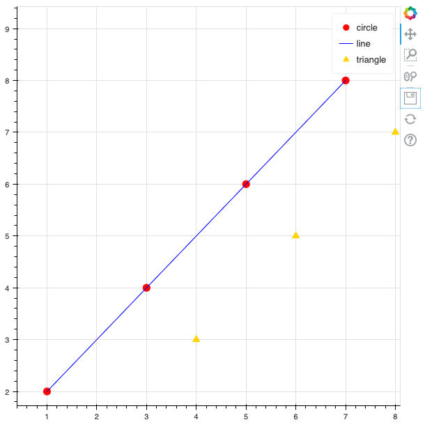
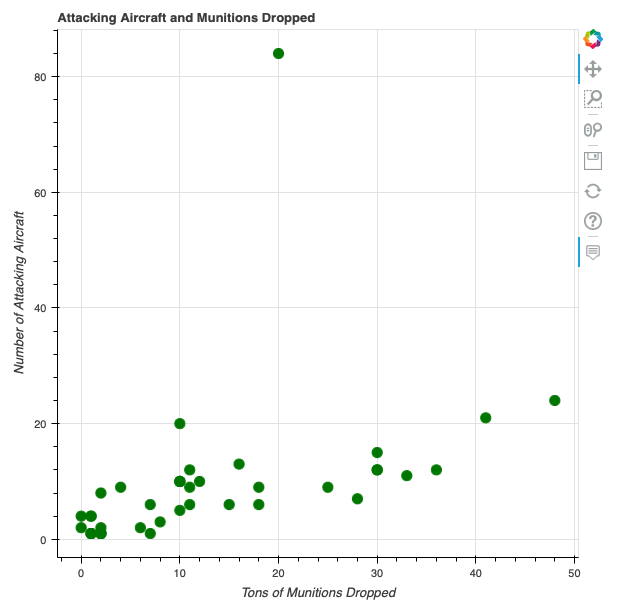

## Source
[Harper, C. (2018). Visualizing data with Bokeh and Pandas. _The Programming Historian_, 7. https://doi.org/10.46430/phen0081](https://programminghistorian.org/en/lessons/visualizing-with-bokeh)

## Reflection
TODO

## Code

### The Basics of Bokeh
Before getting into visualizing the entire data set, we will first look at the 
basics of the bokeh Python library.
```python
# my_first_plot.py
from bokeh.plotting import figure, output_file, show
output_file('my_first_graph.html')

x = [1, 3, 5, 7]
y = [2, 4, 6, 8]

p = figure()

p.circle(x, y, size=10, color='red', legend='circle')
p.line(x, y, color='blue', legend='line')
p.triangle(y, x, color='gold', size=10, legend='triangle')

p.legend.click_policy='hide'
show(p)
```



### Loading Tabular Data in Pandas
We will also look at how we can load tabular data in Pandas from a CSV file.
```python
# loading_data.py
import pandas as pd

df = pd.read_csv('thor_wwii.csv')
print(df)
```

```
           MSNDATE      THEATER COUNTRY_FLYING_MISSION    NAF   UNIT_ID  ... TGT_LONGITUDE  TONS_HE TONS_IC TONS_FRAG  TOTAL_TONS
0       03/30/1941          ETO          GREAT BRITAIN    RAF   84 SQDN  ...     20.070000      0.0     0.0       0.0         0.0
1       11/24/1940          ETO          GREAT BRITAIN    RAF  211 SQDN  ...     19.450000      0.0     0.0       0.0         0.0
2       12/04/1940          ETO          GREAT BRITAIN    RAF  211 SQDN  ...     20.020000      0.0     0.0       0.0         0.0
3       12/31/1940          ETO          GREAT BRITAIN    RAF  211 SQDN  ...     19.490000      0.0     0.0       0.0         0.0
4       01/06/1941          ETO          GREAT BRITAIN    RAF  211 SQDN  ...     19.490000      0.0     0.0       0.0         0.0
...            ...          ...                    ...    ...       ...  ...           ...      ...     ...       ...         ...
178276  08/01/1945          PTO                    USA  20 AF     73 BW  ...    137.216667      0.0   999.0       0.0       999.0
178277  07/22/1942          MTO          GREAT BRITAIN    RAF       NaN  ...     27.200000      0.0     0.0       0.0      1300.0
178278  08/17/1940  EAST AFRICA          GREAT BRITAIN    RAF   47 SQDN  ...     36.400000   4750.0     0.0       0.0      4750.0
178279  08/06/1945          PTO                    USA  20 AF    509 CG  ...    132.466667  15000.0     0.0       0.0     15000.0
178280  08/09/1945          PTO                    USA  20 AF    509 CG  ...    129.866667  20000.0     0.0       0.0     20000.0

[178281 rows x 19 columns]
```

```python
df.columns.tolist()
```

```
['MSNDATE', 'THEATER', 'COUNTRY_FLYING_MISSION', 'NAF', 'UNIT_ID', 'AIRCRAFT_NAME', 'AC_ATTACKING', 'TAKEOFF_BASE', 'TAKEOFF_COUNTRY', 'TAKEOFF_LATITUDE', 'TAKEOFF_LONGITUDE', 'TGT_COUNTRY', 'TGT_LOCATION', 'TGT_LATITUDE', 'TGT_LONGITUDE', 'TONS_HE', 'TONS_IC', 'TONS_FRAG', 'TOTAL_TONS']
```
### The Bokeh ColumnDataSource
```python
# column_datasource.py
import pandas as pd
from bokeh.plotting import figure, output_file, show
from bokeh.models import ColumnDataSource
from bokeh.models.tools import HoverTool

output_file('columndatasource_example.html')

# load data to dataframe and create ColumnDataSource instance
df = pd.read_csv('thor_wwii.csv')

sample = df.sample(50)
source = ColumnDataSource(sample)

p = figure()
p.circle(x='TOTAL_TONS', y='AC_ATTACKING',
         source=source,
         size=10, color='green')

# Add labels to axes
p.title.text = 'Attacking Aircraft and Munitions Dropped'
p.xaxis.axis_label = 'Tons of Munitions Dropped'
p.yaxis.axis_label = 'Number of Attacking Aircraft'

# Add interactive tools to the plot
hover = HoverTool()
hover.tooltips=[
    ('Attack Date', '@MSNDATE'),
    ('Attacking Aircraft', '@AC_ATTACKING'),
    ('Tons of Munitions', '@TOTAL_TONS'),
    ('Type of Aircraft', '@AIRCRAFT_NAME')
]

p.add_tools(hover)

show(p)
```



### Categorical Data and Bar Charts: Munitions Dropped by Country

