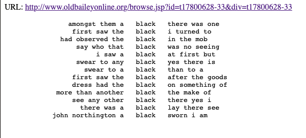

## Source
[Turkel, W. J., & Crymble, A. (2012b). Keywords in Context (Using n-grams) with Python. _The Programming Historian_, 1. https://doi.org/10.46430/phen0010](https://programminghistorian.org/en/lessons/keywords-in-context-using-n-grams)

[Turkel, W. J., & Crymble, A. (2012). Output Keywords in Context in an HTML file with Python. _The Programming Historian_, 1. https://doi.org/10.46430/phen0016](https://programminghistorian.org/en/lessons/output-keywords-in-context-in-html-file)

## Reflection
Instead of plainly studying a text word by word and analyzing its meaning, it is often useful to study the linear sequence of linguistic units to get more meaning out of a text. In general, these linear sequence of units/words are known as n-grams. Using n-grams to infer the context of the given text is called keywords in context (KWIC), which is used in the second lesson that I follow here.

I was able to follow all the concepts and methods detailed in this tutorial, for the code was simple enough to follow and extra methods defined were concise and clear. After completing these two lessons, I can see the potential of using keywords in context and n-grams for textual analysis in the field of Digital Humanities, just because of how much manual effort it saves.

As I started reading the Programming Historian Lesson, I noticed that this lesson did not actually create keywords in context from n-grams but instead only focused on extracting all possible n-grams from a body of text. To also get the KWICs from the n-grams generated, I went ahead and followed the next [lesson](https://programminghistorian.org/en/lessons/output-keywords-in-context-in-html-file) on creating Keywords in Context from an n-gram dictionary. Therefore, this reflection is a representation of a mixture of both these lessons.

## Code

### From Text to N-grams
Since we are working with words as our tokens instead of individual characters, it is imperative we know how to retrieve parts of words using Python.

```python
message9 = "Hello World"
message9a = message9[1:8]
print(message9a)
```
```
ello Wo
```
Similar concept can be used for lists:

```python
wordstring = 'it was the best of times it was the worst of times '
wordstring += 'it was the age of wisdom it was the age of foolishness'
wordlist = wordstring.split()

print(wordlist[0:4])
print(wordlist[0:6])
print(wordlist[6:10])
print(wordlist[0:12])
print(wordlist[:12])
print(wordlist[12:])
```
```
['it', 'was', 'the', 'best']
['it', 'was', 'the', 'best', 'of', 'times']
['it', 'was', 'the', 'worst']
['it', 'was', 'the', 'best', 'of', 'times', 'it', 'was', 'the', 'worst', 'of', 'times']
['it', 'was', 'the', 'best', 'of', 'times', 'it', 'was', 'the', 'worst', 'of', 'times']
['it', 'was', 'the', 'age', 'of', 'wisdom', 'it', 'was', 'the', 'age', 'of', 'foolishness']
```

We can dynamically choose the index to slice from/to, as shown below.
```python
i = 0
for items in wordlist:
    print(wordlist[i: i+5])
    i += 1

# and a helper function to get n-grams of words present in the wordlist
def getNGrams(wordlist, n):
    ngrams = []
    for i in range(len(wordlist)-(n-1)):
        ngrams.append(wordlist[i:i+n])
    return ngrams
```

An example use case of the `getNGrams` method is shown below.
```python
# useGetNGrams.py

import obo

wordstring = 'it was the best of times it was the worst of times '
wordstring += 'it was the age of wisdom it was the age of foolishness'
allMyWords = wordstring.split()

print(obo.getNGrams(allMyWords, 5))
```
```
[['it', 'was', 'the', 'best', 'of'], ['was', 'the', 'best', 'of', 'times'], ['the', 'best', 'of', 'times', 'it'], ['best', 'of', 'times', 'it', 'was'], ['of', 'times', 'it', 'was', 'the'], ['times', 'it', 'was', 'the', 'worst'], ['it', 'was', 'the', 'worst', 'of'], ['was', 'the', 'worst', 'of', 'times'], ['the', 'worst', 'of', 'times', 'it'], ['worst', 'of', 'times', 'it', 'was'], ['of', 'times', 'it', 'was', 'the'], ['times', 'it', 'was', 'the', 'age'], ['it', 'was', 'the', 'age', 'of'], ['was', 'the', 'age', 'of', 'wisdom'], ['the', 'age', 'of', 'wisdom', 'it'], ['age', 'of', 'wisdom', 'it', 'was'], ['of', 'wisdom', 'it', 'was', 'the'], ['wisdom', 'it', 'was', 'the', 'age'], ['it', 'was', 'the', 'age', 'of'], ['was', 'the', 'age', 'of', 'foolishness']]
```

These are all 5-grams of the words present in the wordlist! To experiment more, we can use the Python shell directly:
```python
test1 = 'here are four words'
test2 = 'this test sentence has eight words in it'

getNGrams(test1.split(), 5)
-> [] # empty list because no 5-word split is possible in a 4-item list!

getNGrams(test2.split(), 5)
-> [['this', 'test', 'sentence', 'has', 'eight'], ['test', 'sentence', 'has', 'eight', 'words'], ['sentence', 'has', 'eight', 'words', 'in'], ['has', 'eight', 'words', 'in', 'it']]
```

This concludes the section for the first Programming Historian Lesson. I will carry on with the second Programming Historian Lesson now, which is titled "Output Keywords in Context in an HTML File with Python".

### Making an N-gram Dictionary
In the previous examples, we created odd-numbered N-grams. This property is used to our advantage now, for we will create dictionaries where the key is the middle element of the n-gram. To do this and to successfully identify the index of the middle element of an n-gram, we will define the `nGramsToKWICDict` method.
```python
# identify the index of the keyword given a list of n-grams
def nGramsToKWICDict(ngrams):
    return len(ngrams[0]) // 2
```

We test this method by calling it with an example input:
```python
# get-keyword.py

import obo

test = 'this test sentence has eight words in it'
ngrams = obo.getNGrams(test.split(), 5)

print(obo.nGramsToKWICDict(ngrams)) # we expect this index to be 2
``` 
```
2
```

Now that we know where the keyword is, we change the `nGramsToKWICDict` method to actually get the KWICs from it.
```python
# Given a list of n-grams, return a dictionary of KWICs,
# indexed by keyword.

def nGramsToKWICDict(ngrams):
    keyindex = len(ngrams[0]) // 2

    kwicdict = {}

    for k in ngrams:
        if k[keyindex] not in kwicdict:
            kwicdict[k[keyindex]] = [k]
        else:
            kwicdict[k[keyindex]].append(k)
    return kwicdict
```
Now, if we run the previous program again, we should be able to see our KWICs for the test input.
```python
# get-keyword.py

import obo

test = 'this test sentence has eight words in it'
ngrams = obo.getNGrams(test.split(), 5)

print(obo.nGramsToKWICDict(ngrams))
``` 
```
{'sentence': [['this', 'test', 'sentence', 'has', 'eight']], 'has': [['test', 'sentence', 'has', 'eight', 'words']], 'eight': [['sentence', 'has', 'eight', 'words', 'in']], 'words': [['has', 'eight', 'words', 'in', 'it']]}
```

### Outputting to HTML - Pretty Printing a KWIC
To pretty print is to display the output in a manner that is easily understood and read by humans. We want our KWIC dictionary to look something like this so it can be easily read:
```
               amongst them a black there was one
                first saw the black i turned to
             had observed the black in the mob
                 say who that black was no seeing
                      i saw a black at first but
                 swear to any black yes there is
                   swear to a black than to a
                              ...
```

The current dictionary output is not very readable, as evident by the following example:
```python
# html-to-pretty-print.py
import obo

# create dictionary of n-grams
n = 7
url = 'http://www.oldbaileyonline.org/browse.jsp?id=t17800628-33&div=t17800628-33'

text = obo.webPageToText(url)
fullwordlist = obo.stripNonAlphaNum(text)
ngrams = obo.getNGrams(fullwordlist, n)
worddict = obo.nGramsToKWICDict(ngrams)

print(worddict["black"])
```
```
[['amongst', 'them', 'a', 'black', 'there', 'was', 'one'], ['first', 'saw', 'the', 'black', 'i', 'turned', 'to'], ['had', 'observed', 'the', 'black', 'in', 'the', 'mob'], ['say', 'who', 'that', 'black', 'was', 'no', 'seeing'], ['i', 'saw', 'a', 'black', 'at', 'first', 'but'], ['swear', 'to', 'any', 'black', 'yes', 'there', 'is'], ['swear', 'to', 'a', 'black', 'than', 'to', 'a'], ['first', 'saw', 'the', 'black', 'after', 'the', 'goods'], ['dress', 'had', 'the', 'black', 'on', 'something', 'of'], ['more', 'than', 'another', 'black', 'the', 'make', 'of'], ['see', 'any', 'other', 'black', 'there', 'yes', 'i'], ['there', 'was', 'a', 'black', 'lay', 'there', 'see'], ['john', 'northington', 'a', 'black', 'sworn', 'i', 'am']]
```

To make the output more readable, we need to split the list into three parts: before the keyword, the keyword, and after the keyword. This can be done easily, as shown in the Python shell session below:
```python
kwic = 'amongst them a black there was one'.split()
n = len(kwic)
print(n)
-> 7

# calculate the index position of the keyword
keyindex = n // 2
print(keyindex)
-> 3

# display the items before the keyword
print(kwic[:keyindex])
-> ['amongst', 'them', 'a']

# display the keyword only
print(kwic[keyindex])
-> black

# display the items after the keyword
print(kwic[(keyindex+1):])
-> ['there', 'was', 'one']
```

To turn the lists into string representations, we can simply use the `join` method.
```python
print(' '.join(kwic[(keyindex+1):]))
```
```
there was one
```

To make things look pretty, we will center-align the text on their own line as such:
```python
print('#' + str(kwic[keyindex]).center(len(kwic[keyindex])+6) + '#')
-> #   black   #

width = 10
print('#' + ' '.join(kwic[:keyindex]).rjust(width*keyindex) + '#')
-> #                 amongst them a#
```

Combining all the formatting, we can finally pretty-print our KWICs.
```python
# Given a KWIC, return a string that is formatted for
# pretty printing.

def prettyPrintKWIC(kwic):
    n = len(kwic)
    keyindex = n // 2
    width = 10

    outstring = ' '.join(kwic[:keyindex]).rjust(width*keyindex)
    outstring += str(kwic[keyindex]).center(len(kwic[keyindex])+6)
    outstring += ' '.join(kwic[(keyindex+1):])

    return outstring
```

### Putting It All Together
Using all of the techniques discussed above, we can create a program that takes a URL and a keyword and wraps a KWIC display and output it in HTML that can easily be viewed in any web browser! 
```python
# html-to-kwic.py

import obo

# create dictionary of n-grams
n = 7
url = 'http://www.oldbaileyonline.org/browse.jsp?id=t17800628-33&div=t17800628-33'

text = obo.webPageToText(url)
fullwordlist = ('# ' * (n//2)).split()
fullwordlist += obo.stripNonAlphaNum(text)
fullwordlist += ('# ' * (n//2)).split()
ngrams = obo.getNGrams(fullwordlist, n)
worddict = nGramsToKWICDict(ngrams)

# output KWIC and wrap with html
target = 'black'
outstr = '<pre>'
if target in worddict:
    for k in worddict[target]:
        outstr += prettyPrintKWIC(k)
        outstr += '<br />'
else:
    outstr += 'Keyword not found in source'

outstr += '</pre>'
obo.wrapStringInHTMLMac('html-to-kwic', url, outstr)
```
Opening the `html-to-kwic.html` file using Safari, this is the output I saw:

